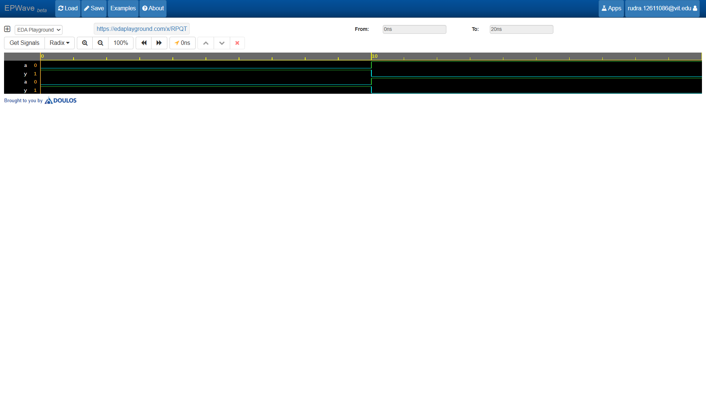

# NOT Gate (Inverter)

Modeled basic single-input logic inversion using the continuous `assign` statement and `~` bitwise operator in Verilog HDL. Verified logic behavior using EPWave waveform simulation.

## Simulation Waveform

