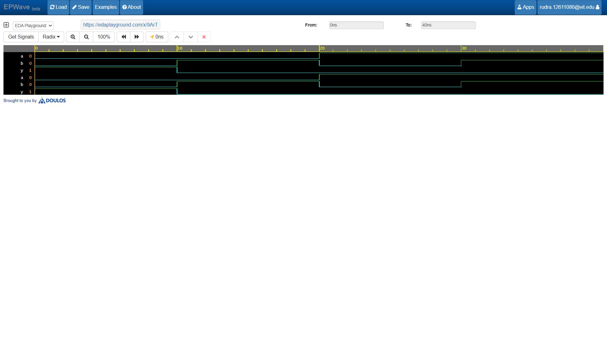

# 2-Input NOR Gate

Modeled universal logic using a continuous `assign` statement with bitwise OR (`|`) and NOT (`~`) operators. Verified logic output using EPWave waveform simulation.

## Simulation Waveform

