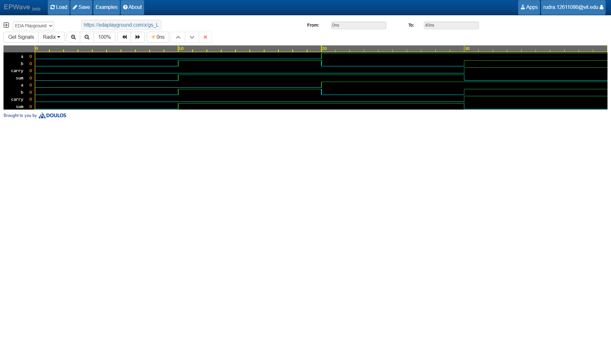

# Half Adder

The Half Adder is a basic combinational circuit that adds two single-bit binary numbers ($A$ and $B$) and produces a **Sum** and a **Carry**.

## Logic Equations
- $\text{Sum} = A \oplus B$
- $\text{Carry} = A \cdot B$

## Truth Table
| A | B | Sum | Carry |
|---|---|-----|-------|
| 0 | 0 |  0  |   0   |
| 0 | 1 |  1  |   0   |
| 1 | 0 |  1  |   0   |
| 1 | 1 |  0  |   1   |

## Waveform Simulation

