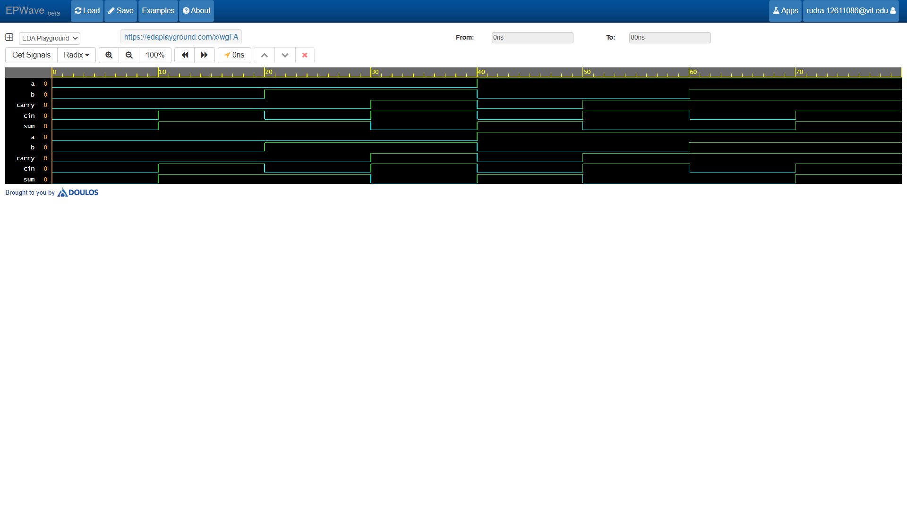

# Full Adder

The Full Adder is a combinational circuit that adds three single-bit binary inputs ($A$, $B$, and $C_{in}$) and produces a **Sum** and a **Carry-out** ($C_{out}$).

## Logic Equations
- $\text{Sum} = A \oplus B \oplus C_{in}$
- $\text{C}_{out} = (A \cdot B) + (B \cdot C_{in}) + (C_{in} \cdot A)$

## Truth Table
| A | B | Cin | Sum | Cout |
|---|---|-----|-----|------|
| 0 | 0 |  0  |  0  |  0   |
| 0 | 0 |  1  |  1  |  0   |
| 0 | 1 |  0  |  1  |  0   |
| 0 | 1 |  1  |  0  |  1   |
| 1 | 0 |  0  |  1  |  0   |
| 1 | 0 |  1  |  0  |  1   |
| 1 | 1 |  0  |  0  |  1   |
| 1 | 1 |  1  |  1  |  1   |

## Waveform Simulation

