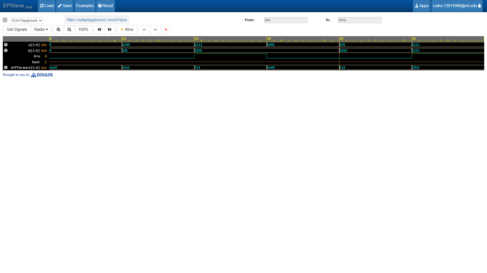

# 4-Bit Ripple Borrow Subtractor

A 4-bit Ripple Borrow Subtractor (RBS) cascades four 1-bit Full Subtractors in series to subtract two 4-bit numbers along with an incoming borrow bit.

## Structural Hardware Architecture

- *Borrow Propagation:* Internal borrow bits `b[2:0]` ripple sequentially from stage $FS_0$ (LSB) up to $FS_3$ (MSB).
- *Stage Connections:*
  - $FS_0$: Accepts $B_{in}$, outputs borrow `b[0]`
  - $FS_1$: Accepts `b[0]`, outputs borrow `b[1]`
  - $FS_2$: Accepts `b[1]`, outputs borrow `b[2]`
  - $FS_3$: Accepts `b[2]`, outputs top-level $B_{out}$

## Waveform Simulation

