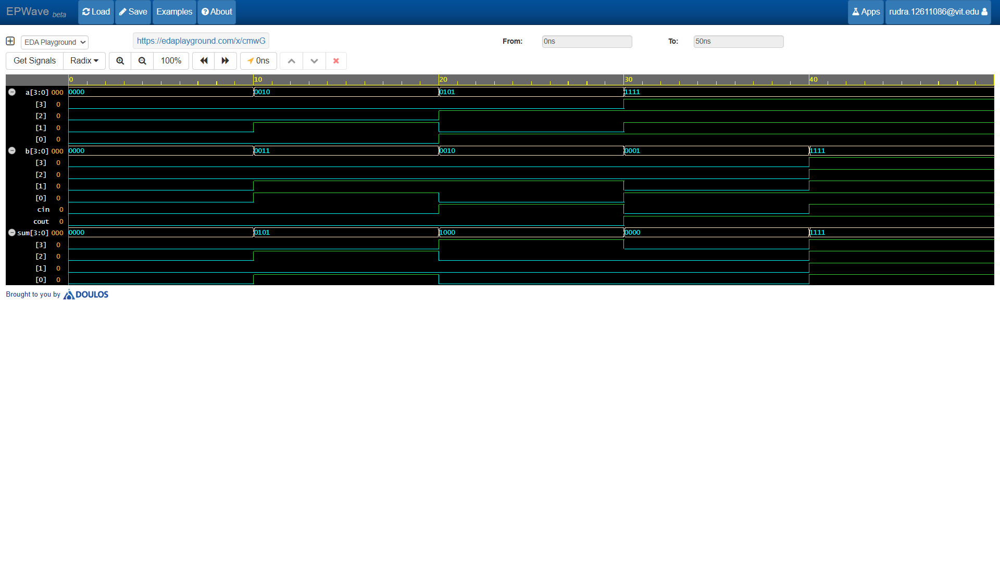

# 4-Bit Ripple Carry Adder

A 4-bit Ripple Carry Adder (RCA) cascades four 1-bit Full Adders in series to add two 4-bit numbers along with an incoming carry bit.

## Structural Hardware Architecture
- **Carry Propagation:** Internal carry bits $c[2:0]$ ripple sequentially from stage $FA_0$ (LSB) up to $FA_3$ (MSB).
- **Stage Connections:**
  - $FA_0$: Accepts $C_{in}$, outputs carry $c[0]$
  - $FA_1$: Accepts $c[0]$, outputs carry $c[1]$
  - $FA_2$: Accepts $c[1]$, outputs carry $c[2]$
  - $FA_3$: Accepts $c[2]$, outputs top-level $C_{out}$

## Waveform Simulation

