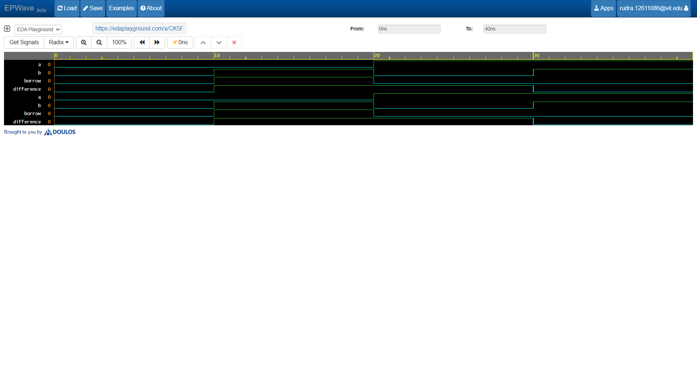

# Half Subtractor

The Half subtractor is a basic combinational circuit that subtracts two single-bit binary numbers ($A$ and $B$) and produces a **Difference** and a **Borrow**.

## Logic Equations
- $\text{Difference} = A \oplus B$
- $\text{Borrow} = \overline{A} \cdot B$

## Truth Table
| A | B |  Difference | Borrow |
|---|---|-------------|--------|
| 0 | 0 |      0      |    0   |
| 0 | 1 |      1      |    1   |
| 1 | 0 |      1      |    0   |
| 1 | 1 |      0      |    0   |

## Waveform Simulation

