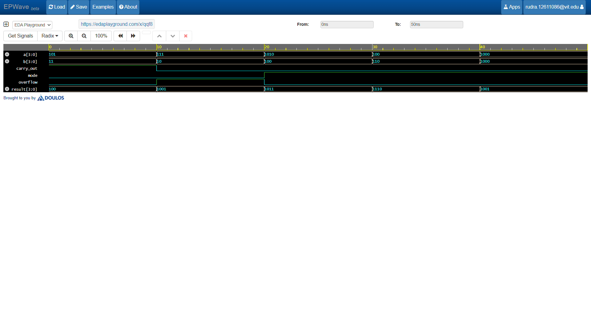

# 4-Bit Adder-Subtractor Circuit

A 4-bit Adder-Subtractor performs binary addition ($A + B$) or binary subtraction ($A - B$) on two 4-bit operands using 2's complement arithmetic, controlled by a single `mode` select line.

## Structural Architecture & Working Principle

- **Mode Control (`mode`):**
  - **`mode = 0` (Addition):** $B_i \oplus 0 = B_i$, $C_0 = 0 \implies \text{Result} = A + B$
  - **`mode = 1` (Subtraction):** $B_i \oplus 1 = \overline{B_i}$, $C_0 = 1 \implies \text{Result} = A + \overline{B} + 1 = A - B$
- **Controlled XOR Inverters:** Bitwise XOR gates invert the input vector $B$ when `mode = 1`.
- **Full Adder Cascade:** Four single-bit Full Adders ($FA_0$ to $FA_3$) ripple the carry bit across all 4 stages.

## Signal Interface

| Signal | Direction | Width | Description |
|--------|-----------|-------|-------------|
| `a` | Input | `[3:0]` | 4-bit First Operand ($A$) |
| `b` | Input | `[3:0]` | 4-bit Second Operand ($B$) |
| `mode` | Input | `1` | Operation Select (`0` = Addition, `1` = Subtraction) |
| `result` | Output | `[3:0]` | 4-bit Sum / Difference Vector |
| `carry_out` | Output | `1` | Final Carry-Out flag ($C_4$) |
| `overflow` | Output | `1` | Signed arithmetic overflow flag ($C_4 \oplus C_3$) |

## Verification Sample

| Mode | $A$ (Dec) | $B$ (Dec) | Result (Bin) | Result (Dec) | Carry Out | Overflow | Operation |
|------|-----------|-----------|--------------|--------------|-----------|----------|-----------|
| `0` | 5 (`0101`) | 3 (`0011`) | `1000` | 8 | 0 | 1 | Addition ($5 + 3 = 8$) |
| `0` | 7 (`0111`) | 2 (`0010`) | `1001` | 9 | 0 | 1 | Addition ($7 + 2 = 9$) |
| `1` | 10 (`1010`)| 4 (`0100`) | `0110` | 6 | 1 | 0 | Subtraction ($10 - 4 = 6$) |
| `1` | 4 (`0100`) | 6 (`0110`) | `1110` | 14 | 0 | 0 | Subtraction ($4 - 6 = -2$ in 2's comp) |
| `1` | 8 (`1000`) | 8 (`1000`) | `0000` | 0 | 1 | 0 | Subtraction ($8 - 8 = 0$) |

## Waveform Simulation

