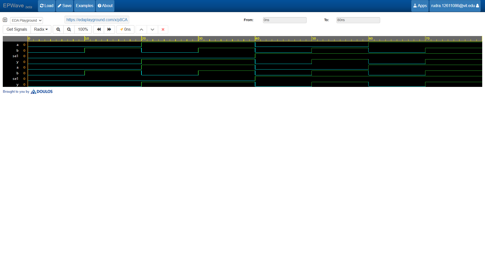

# 2-to-1 Multiplexer (2:1 MUX) 🔀

A **2-to-1 Multiplexer** (MUX) is a combinational logic circuit that routes one of two data inputs (`a` or `b`) to a single output line (`y`) based on a single select signal (`sel`).

---

## 📌 Logic & Truth Table

When `sel = 0`, the output $Y = A$.  
When `sel = 1`, the output $Y = B$.

### Boolean Equation
$$Y = (A \cdot \overline{S}) + (B \cdot S)$$

## 🛠 Features
* Implemented in **Verilog HDL** using dataflow modeling (`assign`).
* Simulated and verified on **EDA Playground** using Cadence Xcelium / EPWave visualizer.

## Waveform Simulation

---
