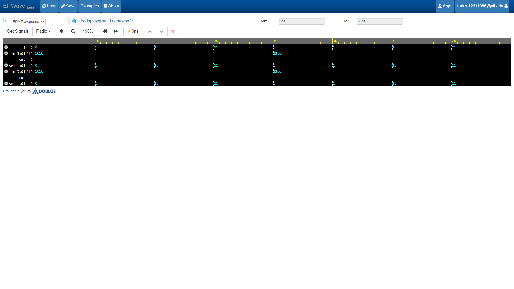

# 4-to-1 Multiplexer (4:1 MUX) 🔀

A **4-to-1 Multiplexer** selects one of four data input lines (`in[0]` through `in[3]`) and routes it to a single output line (`out`) using a 2-bit select control signal (`sel[1:0]`).

---

### Boolean Expression
$$Out = (In_0 \cdot \overline{S_1} \cdot \overline{S_0}) + (In_1 \cdot \overline{S_1} \cdot S_0) + (In_2 \cdot S_1 \cdot \overline{S_0}) + (In_3 \cdot S_1 \cdot S_0)$$

---

## 🛠 Design Approach
* **Behavioral Modeling:** Implemented using Verilog `always @(*)` procedural block paired with a clean `case` statement.
* **Vectorized Inputs:** Leveraged bit vectors (`[3:0] in` and `[1:0] sel`) for concise data path modeling.

---

## Waveform Simulaton

