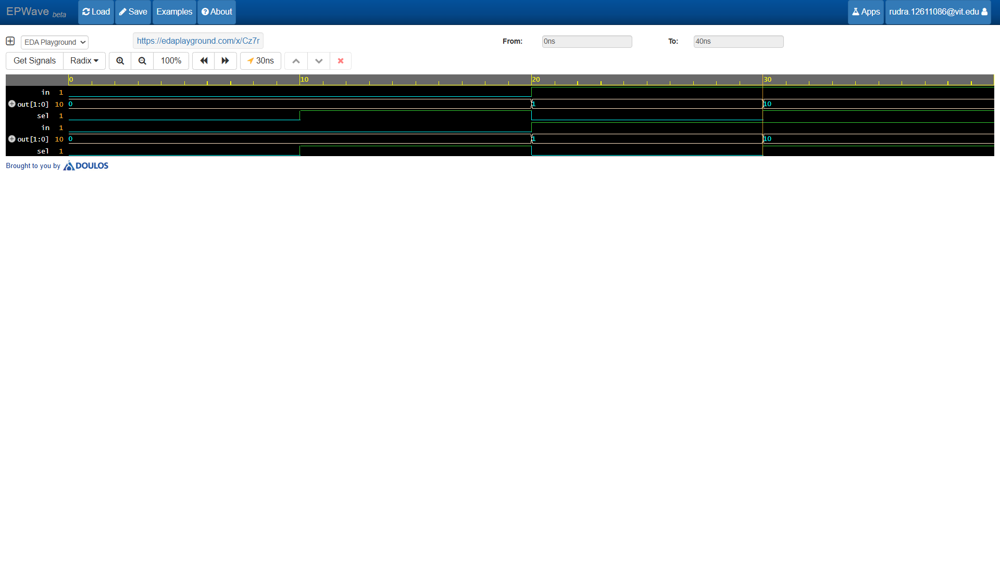

# 1-to-2 Demultiplexer (DEMUX)

## 📝 Description
A **1-to-2 Demultiplexer (DEMUX)** is a combinational circuit that takes a single input data line and routes it to one of two possible output lines. The selection of the active output line is controlled by a single select line (`sel`). It acts as a digital switch distributing data to specific paths.

## 📊 Truth Table

| Data Input (`in`) | Select (`sel`) | `out[1]` | `out[0]` |
| :---: | :---: | :---: | :---: |
| 0 | 0 | 0 | 0 |
| 0 | 1 | 0 | 0 |
| 1 | 0 | 0 | 1 |
| 1 | 1 | 1 | 0 |

*(Note: The unselected output line defaults to `0`)*

## 🛠️ Tools Used
* **Language:** Verilog HDL
* **Simulation Platform:** [EDA Playground](https://edaplayground.com/x/Cz7r)
* **Simulator:** Cadence Xcelium / Icarus Verilog
* **Waveform Viewer:** EPWave

## 🚀 Simulation Waveform

